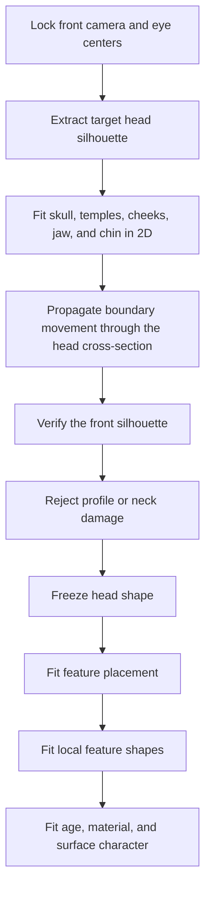

# Picture-to-Mesh Silhouette Proof Implementation Plan

**Goal:** Prove that one front silhouette picture can mold one fixed-topology smooth mesh while preserving topology, existing depth, and independent geometry checks.

**Architecture:** A small standard-Python module extracts front-silhouette spans and changes only the mesh's visible horizontal extent. Blender applies those coordinates as a shape key, renders fixed front/side/three-quarter evidence, and a separate verifier compares the front render with the input picture while checking topology, preserved depth, and face area.

**Tech stack:** Python standard library, Blender 5.2 Python API, `unittest`, PowerShell.

## Global constraints

- Preserve vertex count, face count, and face connectivity.
- Consume one front raster silhouette; the fitter cannot consume the hidden fixture profile.
- Keep all outputs isolated under `research/character-style-exploration/picture-to-mesh-proof/` (`ART-3`).
- Preserve source images, recipe, tool versions, metrics, renders, and decision (`ART-4`).
- Use smooth restrained geometry; this is a mechanical molding test, not final art (`ART-1`).
- Do not commit.

## Capability graph

| Node | Unlocks | Relation | Source | Contract | Work deleted | Verifier | Challenge | Promotion gate |
|---|---|---|---|---|---|---|---|---|
| Raster span reader | Picture constraints | SEQUENCE | Build | Returns left/right occupied spans by row | Manual tracing | Unit test | Empty and asymmetric rows | Exact spans |
| Fixed-topology ring fitter | Molded geometry | SEQUENCE | Build | Changes front-visible width while retaining depth | Manual vertex movement | Unit test | Asymmetric front spans | Exact coordinates, unchanged depth/connectivity |
| Blender shape-key materializer | Reviewable mesh | AND | Adapt | Saves baseline and fitted mesh plus views | Manual Blender setup | Fresh reopen | Baseline and molded states | Valid saved artifact |
| Independent verifier | Promotion decision | AND | Build | Measures front IoU and mesh validity | Subjective success claim | Separate Blender process | Deliberately unmatched baseline | Front fit improves; depth and topology remain unchanged; no degenerate-face failure |

If this existed, we would no longer need to manually move a simple fixed-topology form until its front silhouette matches a reference picture.

## Tasks

### 1. Pure fitting contract

- Write failing `unittest` cases for raster span extraction, interpolation, coordinate molding, and unchanged face connectivity.
- Run them and confirm the missing module failure.
- Add the minimum standard-library implementation and rerun to green.

### 2. Blender materialization

- Generate one immutable front raster fixture for an asymmetric smooth form.
- Build one ring mesh, store the fitted state as a shape key, and save front/side/three-quarter renders plus a manifest.
- Reopen the blend in a fresh Blender process.

### 3. Independent verification

- Render baseline and fitted front masks independently; render side and three-quarter views only as plausibility evidence.
- Measure front silhouette IoU, topology identity, unchanged depth, minimum polygon area, and finite coordinates.
- Reject unless the fitted mesh improves the front view materially and retains depth and valid topology.
- Preserve a causal report and update Art Direction status with the evidence or falsified guarantee.

## First build wave

- Seed nodes: raster spans and fixed-topology rings.
- Falsifying experiment: an asymmetric front fixture that a uniform capsule cannot already match.
- Selected frontier: fixed-topology silhouette molding, because it isolates whether direct mesh fitting works before face semantics or animation constraints are introduced.
- Unlocked dream-machine step: replace synthetic silhouettes with arbitrary reference masks, then add landmark and surface constraints.

Requirements checked: ART-1, ART-3, ART-4; exceptions: none.

## Fourth build wave: anatomical front-fit machine v0

**Goal:** One command turns the approved front-reference package and a versioned fitted
control recipe into a fresh editable anatomical Blender head, three renders, geometry
receipt, and an independent decision record.

**Architecture:** A standard-Python orchestrator validates and hashes one compact
contract, creates an immutable run, and invokes the existing MPFB sculpt builder,
fresh-load verifier, and front-geometry measurer in separate Blender processes. The
machine records mechanical acceptance separately from pending human visual acceptance.

| Node | Unlocks | Relation | Source | Contract | Work deleted | Verifier | Challenge | Promotion gate |
|---|---|---|---|---|---|---|---|---|
| MPFB anatomical template | Editable head | SEQUENCE | Borrow | Stable 19,158-vertex source | Rebuilding anatomy | Existing hard checks | Missing or changed source | Bound source hash |
| Front evidence package | Measurable target | SEQUENCE | Adapt | Image plus semantic ratios and uncertainty | Unrecorded picture interpretation | Hash and schema checks | Wrong image or annotation | All identities match |
| Calibrated sculpt adapter | Fresh candidate | SEQUENCE | Borrow | Recipe creates view-independent shape key | Manual Blender reconstruction | Fresh reopen | Projection, rig, invalid topology | All hard checks pass |
| Machine orchestrator | Replayable result | AND | Build | One command records inputs, commands, receipts, and decision | Manual pipeline reconstruction | Pure unit tests plus real run | Existing run, bad hashes, metric miss | Mechanical pass; visual remains human-reviewed |

### Implementation tasks

- [x] Write a failing standard-library test for immutable run initialization and
  decision separation.
- [x] Add the minimum orchestrator and contract needed to make the test pass.
- [x] Execute one fresh Blender run through build, reopen verification, and measurement.
- [x] Inspect its three renders and record the mechanical and visual decisions.
- [x] Update the machine registry and Art Direction evidence with the result.

Selected frontier: orchestration, because every expensive component already exists and
the missing guarantee is reproducible end-to-end execution. If this existed, we would no
longer need to manually reconstruct how a front-derived candidate was built and judged.

Requirements checked: ART-1, ART-2, ART-3, ART-4; exceptions: none.

## Eighth build wave: direct anatomical head boundary

- Corrected the semantic chin anchor from an off-centre jaw vertex to centreline vertex
  `5225`; the old measurement could approve the wrong lower-face proportion.
- Extracted the complete front head boundary directly from the target, normalized by the
  fixed eye line and interpupillary distance.
- Rejected the unsmoothed fit because it transferred raster-edge noise and ear transitions
  into visible temple ripples.
- `Derived/head-silhouette-v3/` applies a smoothed, cross-section-propagated shape key.
  Fresh verification reduces the complete normalized boundary score from `0.348837` to
  `0.019911` (`94.29%`) with unchanged topology, zero depth-axis change, and maximum
  displacement `0.012273 m`.
- Visual decision: retain the reusable head-boundary control; reject likeness. The
  three-quarter view still exposes a temple/cheek indentation, while feature placement,
  local feature anatomy, age, and material deliberately remain downstream.

Requirements checked: ART-1, ART-2, ART-3, ART-4; exceptions: none.

## Ninth build wave: head-evaluator correction

- Invalidated automatic lower-face silhouette scoring: below the jaw, front raster row
  extrema follow the connected neck rather than the visible jaw-to-chin contour.
- `head-silhouette-v4.json` restricts outer-boundary deformation to the skull, temples,
  and face sides, with a short transition back to the source width. Jaw/chin width now
  requires its own visible contour control instead of borrowing neck pixels.
- The verifier reports skull, temple, and face-side errors independently. Mechanical
  success produces `mechanical-pass-awaiting-visual-review`, never promotion.
- Every reviewed candidate must preserve eye/IPD-aligned target and generated crops,
  plus a sharp centre wipe and full-opacity blink. Promotion requires explicit pass decisions for skull, temples, ears,
  jaw/chin, and overall shape, with hashes binding the review to those images.
- Original-case replay `Derived/head-silhouette-v4/` mechanically improves the valid
  outer regions by `83.88%`, but the aligned review rejects all five visual regions and
  records `promotionEligible=false`. This is the intended correction of v3's false
  promotion.
- Bounded review classified the failure as execution: builder and verifier shared the
  same faulty row-extrema assumption and the diagnostic layer was outside the gate. No
  skill change is required.

Requirements checked: ART-1, ART-2, ART-3, ART-4; exceptions: none.

## Fifth build wave: direct style-macro controls

- Added one topology-preserving `StyleMacroDirect` shape key over the retained MPFB head.
- The control separates upper height, lower-face height, cheek contour, jaw contour, and
  lateral falloff instead of scaling the whole head.
- `style-macro-v1` established a measured response; `style-macro-v2` used that response
  to calibrate rather than guess again.
- Macro score fell from `0.288546` to `0.069615`. Cheek width, jaw width, eye-to-chin
  height, and lower-face taper now each land within `0.001` of the target ratio. Mouth
  width was intentionally untouched and now accounts for almost all remaining macro
  error.
- Fresh reopen verifies unchanged topology, zero depth-axis displacement, maximum
  displacement `0.004489`, three valid views, finite coordinates, and no rig or animation.
- Visual call: retain the reusable macro control; reject the head as a likeness. Eye,
  nose, mouth, age, and asymmetry controls remain necessary. Upper-skull compression is
  provisional because the painted source hides the skull under hair.

Requirements checked: ART-1, ART-2, ART-3, ART-4; exceptions: none.

## Seventh build wave: visible presentation and broad challengers

- Added replayable solid-material skin, lips, sclera, iris, pupils, and source-geometry
  brows so comparisons are no longer dominated by the peach clay placeholder.
- Added bounded eye-bag, lip-volume, and brow-form controls. No image projection or image
  texture is visible in the candidate.
- Rejected one presentation overshoot, one global lower-face stretch that damaged the
  jaw-neck transition, and one moderate jaw challenger that moved away from retained
  geometry evidence.
- `Derived/style-presentation-v5/` retains the established macro and eye fit, passes fresh
  front / three-quarter / profile verification, and is the new presentation champion.
  Human likeness remains rejected.
- Falsified shortcut: matching broad face proportions plus stock MPFB detail targets does
  not reproduce individual eyelid, socket, lip, or nose structure. The next experiment
  requires local semantic deformation masks rather than more global scalar tuning.

Requirements checked: ART-1, ART-2, ART-3, ART-4; exceptions: none.

## Sixth build wave: mouth and eye controls

- Added a bounded mouth-narrow target after proving the inherited mouth-width slider
  could not reach the painted reference. Mouth-width ratio error fell from `0.068559` to
  `0.000943` without an obvious front or side-view collapse.
- Added independent eye-span, eye-height, and inherited eye-narrow controls. Two measured
  probes exposed stable response and MPFB anatomical-left versus screen-left naming.
- `Derived/style-eyes-v2/` reduces combined horizontal eye-span and vertical-aperture
  error from `0.050160` to `0.000253`. It also removes opposing narrow/open morphs while
  retaining the same target dimensions.
- Visual call: retain the reusable controls; reject likeness. Exact bounding dimensions
  still leave incorrect lid curves, canthi, globe fit, and generic socket structure.
- Next isolated experiment: measure multiple lid-curve samples and globe exposure. Do not
  continue retuning eye width or aperture.

Requirements checked: ART-1, ART-2, ART-3, ART-4; exceptions: none.

### Fourth-wave result

- Run `anatomical-front-fit-v0-20260720-1` completed all three local Blender stages.
- Mechanical decision: pass. Total front-feature ratio error is `0.006962` against the
  contract maximum `0.02`; the fresh verifier confirms three views, an editable direct
  shape key, no projection, no armature, and no animation.
- Visual decision: reject. The mesh is a valid anatomical head but remains too tall,
  round, narrow-jawed, pinched-eyed, and generic in the nose and mouth to reproduce the
  reference.
- Falsified guarantee: replaying a previously measured control recipe is not equivalent
  to compiling an arbitrary front picture into a close head.
- Next isolated experiment: semantic front landmarks compile bounded anatomical control
  proposals; geometry gates prune them before human visual comparison.

Requirements checked: ART-1, ART-2, ART-3, ART-4; exceptions: none.

## Third-wave result

- `Derived/mask-v8/` replays one fixed recipe over balanced, broad, and crooked inputs.
- All three pass front IoU `>= 0.9934`, named facial depth ordering, exact topology and
  rear preservation, finite coordinates, positive face area, and edge stretch `<= 1.75`.
- The successful relaxation retains `0.063` of the source depth evidence while applying
  topology-neighbor smoothing. Lower values erased a held-out brow/eye plane; higher
  values exceeded the broad mesh stretch gate.
- Visual review rejects this as a production head. It is a recognizable front bas-relief,
  but the profile and back are unconditioned guesses and the ring topology cannot express
  eyelids, lips, nostrils, ears, or skull anatomy.
- Generator implication: retain the objective fitting loop, fixed topology contract, and
  independent visual review. Replace the generic ring with an anatomical head prior and
  semantic regions; an ordinary painting still needs depth/landmark interpretation or
  additional views.

Requirements checked: ART-1, ART-3, ART-4; exceptions: none.

## Third build wave: recognizable closed mask

**Goal:** Combine the proven front silhouette and local-depth operations on one closed,
fixed topology whose input picture visibly describes a mask-like face.

- One grayscale front picture encodes occupied silhouette plus relative front depth.
- The fixed closed mesh changes front-visible width, then only its front hemisphere
  receives local depth; its rear hemisphere remains unchanged.
- The verifier checks front silhouette IoU, named depth ordering for brow/eyes/nose/
  cheeks/mouth/chin, unchanged rear vertices and topology, bounded edge stretch, finite
  coordinates, and positive face area.
- After the primary mask passes, reuse the same code and topology on held-out broad and
  crooked proportion variants.

Promotion requires front IoU `>= 0.95`, every named depth-order relation, exact topology
and rear preservation, maximum edge stretch `<= 1.75`, finite coordinates, and positive
face area.

Requirements checked: ART-1, ART-3, ART-4; exceptions: none.

## Second build wave: internal depth

**Goal:** Prove that one grayscale front image can drive local depth on a fixed-topology
surface after the silhouette-only seed succeeds.

- Input brightness has an explicit depth meaning; ordinary-image depth inference remains
  outside this experiment.
- Write failing tests for image sampling and coordinate-only relief displacement.
- Materialize one fixed grid with a `FittedDepth` shape key and preserve its connectivity.
- Freshly reopen it and independently measure depth RMSE, unchanged image-plane
  coordinates, finite geometry, non-degenerate faces, and bounded edge stretch.
- Preserve the input depth picture, `.blend`, diagnostic renders, manifest, and decision
  under `Derived/depth-v1/`.

Promotion requires depth RMSE `<= 0.002`, unchanged topology and image-plane coordinates,
finite coordinates, positive face area, and maximum edge stretch `<= 1.5`.

Requirements checked: ART-1, ART-3, ART-4; exceptions: none.
