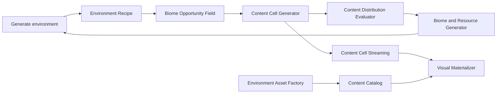

# World Content Machine Retrospective

## Outcome

- Dream slice: a seed produces physically coherent terrain content that can be evaluated
  before assets, Actors, sites, raids, or characters exist.
- Current champion chain correctly separates physical evidence from rendering.
- Current failure: Content Cell v5 uses vegetation/stone magnitude mainly as a kind ratio;
  valid land still tends to fill the same placement budget.
- Graph defect: `world.biome-resource-generator` depends on the environment asset factory
  and catalog even though its declared output is neutral distribution evidence.

## Capability tree

- `R <- AND(terrain, intent, climate, drainage, surface conditions, biome)`.
- `C <- AND(R, O)`.
- `B <- AND(C, E)`; assets are not a prerequisite for neutral distribution.
- `M <- AND(C, catalog, performance)`; placeholder or finished assets are replaceable.

## Retrospective call

- Add one independent evaluator rather than another generator.
- Make physical opportunity magnitude control density only after the evaluator proves the
  current constant-density failure.
- Keep semantic placement recipes authoritative; Unreal debug drawing and assets remain
  derived adapters.
- Do not promote `world.biome-resource-generator` until held-out root-scale distribution
  evidence passes.

If this existed, we would no longer need to open every seed to determine whether sparse
and dense terrain content obeys its physical evidence.

Requirements checked: WORLD-1; exceptions: none.
