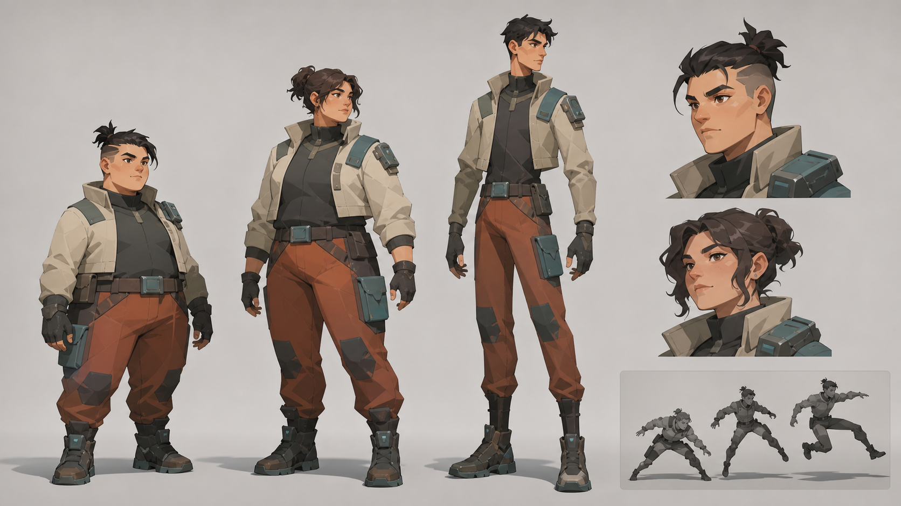
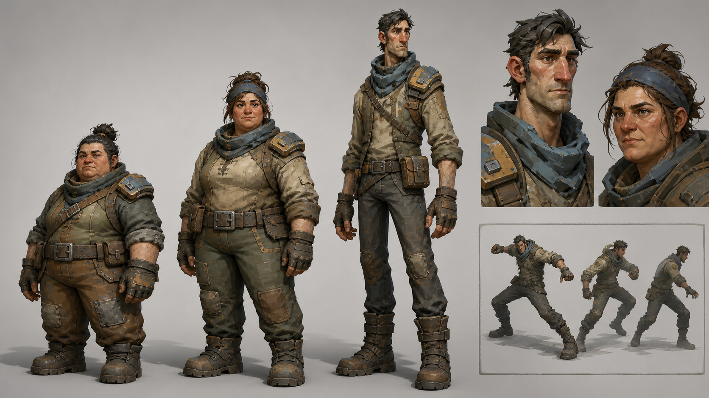
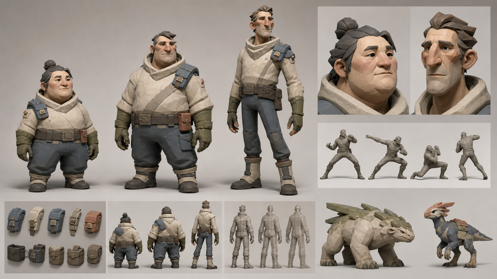
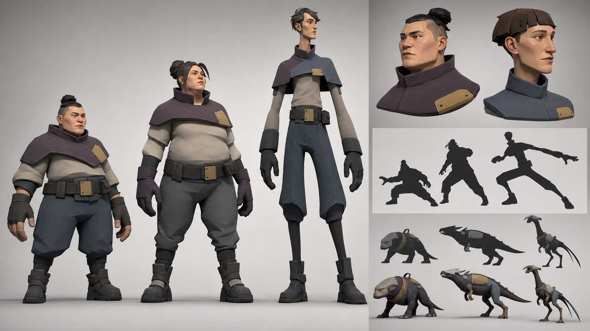

# Character style exploration

Status: visual research only. No direction is selected, and none of this changes the
current style contract or canon.

## Comparison frame

Each board uses the same test: three ordinary adults with different builds, neutral
expedition clothing, a small modular attachment, face studies, and motion silhouettes.
The images are prompts for a production test, not model sheets. In particular, AI image
consistency does not prove topology, deformation, texture reproducibility, or runtime
readability.

| Direction | Distinguishing bet | Generation difficulty | Rigging risk | Asset reuse |
| --- | --- | --- | --- | --- |
| A. Graphic Cut | Planes and value blocks carry the character | Medium | Medium | High if hair and garment planes are standardized |
| B. Rugged Brush | Shape asymmetry plus broad painted wear | High | Low–medium | Medium; textures need authored variation |
| C. Soft Carve | A few sculpted volumes carry face and body | Low–medium | Low | Very high |
| D. Broken Silhouette | Proportion rhythm and negative space carry identity | Medium–high | High | Medium–high if proportion families stay bounded |

## A — Graphic Cut

- **Geometry / proportion:** tapered planar anatomy, clean breaks at shoulder, hip,
  knee, and hair; normal human proportion range with visibly different body masses.
- **Face:** reduced planes, strong brow–nose–jaw design, graphic hair clumps. The risk
  is converging on one attractive face unless generators are explicitly conditioned on
  age, weight, nose, jaw, and eye-spacing variation.
- **Material:** matte stylized PBR with two or three large value groups and selective
  edge highlights. It should not depend on a fragile outline shader.
- **Animation:** held poses and fast attacks read well because limb angles are clean.
  Facial animation needs shape-specific correctives to stop broad planes from folding.
- **Equipment / LOD:** modular shells can inherit the same planar breaks. Large color
  fields survive LODs; hair tips and collar notches should disappear early.
- **Aura / VFX:** clean contours accept rim auras and motion streaks without becoming
  noisy. Bright effects must not erase the small dark-light face pattern.
- **Creature compatibility:** repeat tapered limbs, wedge heads, and large value blocks;
  avoid simply putting human hair spikes on creatures.
- **Tradeoff:** strongest graphic combat read, but the easiest option to drift into
  generic anime-action polish or one idealized body template.
- **One-character Blender falsification:** build one soft-bodied adult with an
  asymmetric face, two hair swaps, and one shoulder module. Test a turntable, run,
  overhead strike, facial phonemes, three LODs, and a bright edge aura. Reject the
  direction if planes shimmer, expressions crease like paper, or the aura collapses
  the face and torso into one value.

## B — Rugged Brush

- **Geometry / proportion:** chunky mid-poly masses, slightly large hands and boots,
  visible age and body asymmetry; the silhouette stays grounded rather than heroic.
- **Face:** broad structural landmarks plus uneven features and weathering. This gives
  generators more identity anchors, but maintaining the same face across outputs is
  harder than in a simpler style.
- **Material:** broad, directional painted wear in albedo and restrained roughness;
  no dense scratch maps. Texture authorship, not polygon count, carries much of the cost.
- **Animation:** weighty locomotion and contact sell the style. Generic floaty retargeted
  animation will make the rugged forms feel like costumes over mannequins.
- **Equipment / LOD:** broad bevels and patched material zones are modular, but every
  reused part needs controlled wear variation to prevent obvious clones.
- **Aura / VFX:** earthy surfaces give bright effects room, though busy painted values
  can fight status colors. Reserve quiet zones around hands, head, and torso center.
- **Creature compatibility:** strong fit for thick hides, worn plates, broad facial
  landmarks, and imperfect symmetry without requiring more shaders.
- **Tradeoff:** high tactile character and broad body diversity, paid for with the
  hardest repeatable texture-generation problem and more visible animation quality.
- **One-character Blender falsification:** build one older compact adult from a single
  mid-poly base, one cloth set, and one 2K painted texture. Generate two texture variants,
  then test close face, gameplay camera, run, climb, hit reaction, three LODs, and a
  saturated status aura. Reject if wear turns to noise, variants lose identity, or the
  movement lacks believable mass.

## C — Soft Carve

- **Geometry / proportion:** rounded wedges and compressed planes; a small number of
  large sculpted decisions separates short, soft, and long builds. The board also shows
  how the same grammar can carry equipment and creatures.
- **Face:** small eyes set inside large nose, cheek, brow, and chin masses. Expression is
  readable with few controls, but a narrow facial vocabulary could make the cast feel
  related or overly gentle.
- **Material:** matte mineral or clay-like stylized PBR with restrained speckle. Broad
  folds belong in geometry; surface maps stay cheap and stable.
- **Animation:** forgiving deformation and readable squash are production-friendly.
  Fingers, eyelids, and mouth corners need enough resolution to avoid maquette stiffness.
- **Equipment / LOD:** strongest reuse case: nested solids, broad bevels, shared base
  meshes, and clean LOD collapse. Swaps must alter silhouette, not just color.
- **Aura / VFX:** quiet surfaces are an excellent VFX canvas. Soft silhouettes may need
  sharper effect timing or one angular accent so combat does not feel sleepy.
- **Creature compatibility:** direct: carved masses, plate clusters, and wedge heads work
  across bipeds, quadrupeds, and mounts without a separate rendering language.
- **Tradeoff:** lowest-cost coherent pipeline and best creature bridge, with the real
  risk of reading as safe, toy-like, or emotionally too soft.
- **One-character Blender falsification:** sculpt one average soft-bodied adult from
  primitive volumes, retopologize to a shared skeleton, add two face variations and two
  equipment shells, then test close dialogue, sprint, dodge, heavy attack, three LODs,
  and an aggressive aura. Reject if it reads as a collectible toy, the face cannot show
  tension, or equipment swaps fail to change gameplay silhouette.

## D — Broken Silhouette

- **Geometry / proportion:** identity comes from bounded limb-rhythm families: compact
  torso, shifted shoulder line, and deliberately long distal limbs with clear negative
  spaces. This is anatomy art direction, not a cape or shoulder-pad trick.
- **Face:** simple human surfaces with strong profile wedges and controlled head shapes.
  Faces can stay quieter because full-body recognition does more work.
- **Material:** broad matte panels and minimal seams reinforce proportion; texture is
  deliberately subordinate to contour.
- **Animation:** biggest unknown. Long forearms and shins amplify foot sliding, IK errors,
  hand intersections, and retargeting artifacts. Motion could become uniquely elastic if
  authored for the proportions rather than inherited unchanged.
- **Equipment / LOD:** define protected silhouette zones at head, outer forearm, waist,
  and lower leg. Modules may occupy one zone but cannot fill every gap. LODs are cheap,
  while shared clothing fits across proportion families may not be.
- **Aura / VFX:** strongest contour tracing and motion-arc opportunity. The same gaps that
  help auras can make dense particle fields visually confusing, so effects need restraint.
- **Creature compatibility:** elongated distal forms, offset masses, and open negative
  spaces transfer naturally to runners, mounts, and heavy quadrupeds.
- **Tradeoff:** most ownable distant silhouette and broad creature language, with the
  highest skeleton, cloth-fit, animation, and camera-framing risk.
- **One-character Blender falsification:** build the tall long-limbed adult on the closest
  feasible shared humanoid rig, with one conventional-proportion control mesh. Run the
  exact same locomotion, vault, crouch, melee combo, mount, camera collision, two gear
  swaps, three LODs, and contour aura on both. Reject if retargeting needs per-clip repair,
  hands clip the torso, or gear erases the negative spaces.

## What the boards do not decide

- Palette, clothing language, factions, classes, items, and character identities.
- Whether player bodies use presets, sliders, or authored archetypes.
- A shared skeleton count, texture budget, shader features, or final LOD thresholds.
- Whether the character direction must exactly match the environment surface treatment.

The next decision should follow the Blender falsification tests, not the prettiest board.
One neutral character is enough to expose the expensive failure mode in each direction.

## Generation record

- Mode: built-in image generation.
- Prompt set: four independent `stylized-concept` prompts using the shared neutral cast,
  studio board layout, production constraints, and direction-specific geometry, face,
  material, animation-read, VFX, and creature-language requirements.
- The source prompts deliberately excluded named-franchise imitation, lore, classes,
  weapons, ornate armor, idealized repeated bodies, generic MMO polish, text, and logos.
